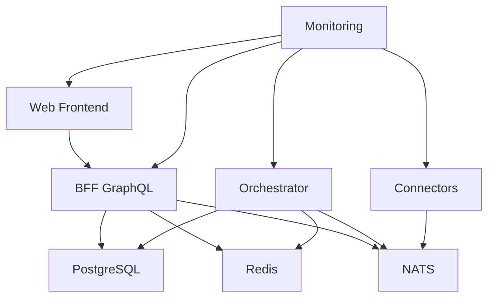

# ZAMC Infrastructure

This directory contains Infrastructure as Code (IaC) for the ZAMC platform, providing both Docker Compose and Kubernetes deployment options.

## 🏗️ Architecture Overview

```
┌─────────────────────────────────────────────────────────────────┐
│                        ZAMC Platform                           │
├─────────────────────────────────────────────────────────────────┤
│  Frontend (React/Vite)  │  BFF (Go/GraphQL)  │  Services       │
│  ┌─────────────────┐    │  ┌───────────────┐  │  ┌─────────────┐ │
│  │   ZAMC Web      │    │  │   GraphQL     │  │  │ Orchestrator│ │
│  │   - React       │◄───┤  │   - Go        │◄─┤  │ - Python    │ │
│  │   - Vite        │    │  │   - gqlgen    │  │  │ - FastAPI   │ │
│  │   - Tailwind    │    │  │   - Auth      │  │  │ - AI/ML     │ │
│  └─────────────────┘    │  └───────────────┘  │  └─────────────┘ │
│                         │                     │  ┌─────────────┐ │
│                         │                     │  │ Connectors  │ │
│                         │                     │  │ - Go        │ │
│                         │                     │  │ - Google Ads│ │
│                         │                     │  │ - Meta API  │ │
│                         │                     │  └─────────────┘ │
├─────────────────────────────────────────────────────────────────┤
│                    Infrastructure Layer                        │
│  ┌─────────────┐  ┌─────────────┐  ┌─────────────┐             │
│  │ PostgreSQL  │  │    Redis    │  │    NATS     │             │
│  │ - Database  │  │ - Cache     │  │ - Events    │             │
│  │ - Supabase  │  │ - Sessions  │  │ - Pub/Sub   │             │
│  └─────────────┘  └─────────────┘  └─────────────┘             │
└─────────────────────────────────────────────────────────────────┘
```

## 📁 Directory Structure

```
infra/
├── compose/                    # Docker Compose setup
│   ├── docker-compose.yml     # Main compose file
│   ├── env.example            # Environment variables template
│   ├── Makefile              # Management commands
│   ├── dockerfiles/          # Service Dockerfiles
│   │   ├── Dockerfile.web
│   │   ├── Dockerfile.bff
│   │   ├── Dockerfile.orchestrator
│   │   └── Dockerfile.connectors
│   ├── configs/              # Configuration files
│   │   └── nginx.conf
│   ├── monitoring/           # Monitoring setup
│   │   ├── prometheus.yml
│   │   └── grafana/
│   └── init-scripts/         # Database initialization
│       └── 01-init-database.sql
└── k8s/                      # Kubernetes setup
    └── helm/                 # Helm charts
        └── zamc/             # Main ZAMC chart
            ├── Chart.yaml
            ├── values.yaml
            └── templates/    # Kubernetes manifests
```

## 🚀 Quick Start

### Option 1: Docker Compose (Recommended for Development)

```bash
# Navigate to compose directory
cd infra/compose

# Setup environment
make setup

# Edit environment variables
vim .env

# Start all services
make up

# View service URLs
make urls
```

### Option 2: Kubernetes with Helm (Recommended for Production)

```bash
# Navigate to k8s directory
cd infra/k8s

# Install with Helm
helm install zamc helm/zamc/ -f values-production.yaml

# Check deployment status
kubectl get pods -l app.kubernetes.io/name=zamc
```

## 🐳 Docker Compose Deployment

### Prerequisites

- Docker 20.10+
- Docker Compose 2.0+
- Make (optional, for convenience commands)

### Local Development Setup

1. **Initial Setup**
   ```bash
   cd infra/compose
   make setup
   ```

2. **Configure Environment**
   ```bash
   # Copy and edit environment file
   cp env.example .env
   vim .env
   ```

   **Required Configuration:**
   ```bash
   # AI API Keys
   OPENAI_API_KEY=sk-your-openai-key
   ANTHROPIC_API_KEY=sk-ant-your-anthropic-key
   
   # Google Ads API
   GOOGLE_ADS_DEVELOPER_TOKEN=your-token
   GOOGLE_ADS_CLIENT_ID=your-client-id
   GOOGLE_ADS_CLIENT_SECRET=your-secret
   GOOGLE_ADS_REFRESH_TOKEN=your-refresh-token
   GOOGLE_ADS_CUSTOMER_ID=your-customer-id
   
   # Meta Marketing API
   META_APP_ID=your-app-id
   META_APP_SECRET=your-app-secret
   META_ACCESS_TOKEN=your-access-token
   META_AD_ACCOUNT_ID=your-ad-account-id
   ```

3. **Start Services**
   ```bash
   # Start core infrastructure only
   make up-core
   
   # Start application services
   make up-apps
   
   # Start everything (including monitoring)
   make up-full
   ```

4. **Access Services**
   ```bash
   # View all service URLs
   make urls
   
   # Open services in browser
   make open
   ```

### Available Services

| Service | URL | Description |
|---------|-----|-------------|
| **Frontend** | http://localhost:3000 | React web application |
| **GraphQL API** | http://localhost:4000/graphql | BFF GraphQL endpoint |
| **Orchestrator** | http://localhost:8001 | AI strategy service |
| **Connectors** | http://localhost:8002 | Ad deployment service |
| **PostgreSQL** | localhost:5432 | Database |
| **Redis** | localhost:6379 | Cache |
| **NATS** | localhost:4222 | Message broker |
| **NATS Monitor** | http://localhost:8222 | NATS monitoring |

### Monitoring (Optional)

```bash
# Start with monitoring
make up-monitoring

# Access monitoring tools
# Prometheus: http://localhost:9090
# Grafana: http://localhost:3001 (admin/admin)
# Jaeger: http://localhost:16686
```

### Development Tools (Optional)

```bash
# Start development tools
make up-dev-tools

# Access tools
# pgAdmin: http://localhost:5050
# Redis Commander: http://localhost:8081
```

### Management Commands

```bash
# View logs
make logs                    # All services
make logs-web               # Frontend only
make logs-bff               # BFF only

# Service management
make restart-web            # Restart frontend
make restart-bff            # Restart BFF
make health                 # Health check all services

# Database operations
make db-shell               # Connect to PostgreSQL
make db-backup              # Backup database
make db-restore BACKUP_FILE=backup.sql

# Cleanup
make down                   # Stop all services
make clean                  # Remove containers and volumes
```

## ☸️ Kubernetes Deployment

### Prerequisites

- Kubernetes 1.24+
- Helm 3.8+
- kubectl configured
- Ingress controller (nginx recommended)
- Cert-manager (for TLS certificates)

### Production Setup

1. **Add Helm Repositories**
   ```bash
   # Add required repositories
   helm repo add bitnami https://charts.bitnami.com/bitnami
   helm repo add nats https://nats-io.github.io/k8s/helm/charts/
   helm repo update
   ```

2. **Create Namespace**
   ```bash
   kubectl create namespace zamc
   ```

3. **Configure Secrets**
   ```bash
   # Create secrets file
   cat > values-secrets.yaml << EOF
   secrets:
     ai:
       openaiApiKey: "sk-your-openai-key"
       anthropicApiKey: "sk-ant-your-anthropic-key"
     googleAds:
       developerToken: "your-token"
       clientId: "your-client-id"
       clientSecret: "your-secret"
       refreshToken: "your-refresh-token"
       customerId: "your-customer-id"
     meta:
       appId: "your-app-id"
       appSecret: "your-app-secret"
       accessToken: "your-access-token"
       adAccountId: "your-ad-account-id"
   EOF
   ```

4. **Deploy with Helm**
   ```bash
   cd infra/k8s
   
   # Install ZAMC
   helm install zamc helm/zamc/ \
     --namespace zamc \
     --values values-production.yaml \
     --values values-secrets.yaml
   ```

5. **Verify Deployment**
   ```bash
   # Check pods
   kubectl get pods -n zamc
   
   # Check services
   kubectl get svc -n zamc
   
   # Check ingress
   kubectl get ingress -n zamc
   ```

### Production Configuration

Create `values-production.yaml`:

```yaml
# Production overrides
global:
  imageRegistry: "your-registry.com"

web:
  replicaCount: 3
  ingress:
    hosts:
      - host: zamc.yourdomain.com
        paths:
          - path: /
            pathType: Prefix

bff:
  replicaCount: 3
  ingress:
    hosts:
      - host: api.yourdomain.com
        paths:
          - path: /
            pathType: Prefix

# Enable monitoring
monitoring:
  enabled: true
  prometheus:
    enabled: true
  grafana:
    enabled: true

# Production database settings
postgresql:
  primary:
    persistence:
      size: 100Gi
    resources:
      limits:
        cpu: 2000m
        memory: 4Gi
      requests:
        cpu: 1000m
        memory: 2Gi
```

### Scaling

```bash
# Scale services
kubectl scale deployment zamc-web --replicas=5 -n zamc
kubectl scale deployment zamc-bff --replicas=3 -n zamc

# Enable autoscaling
kubectl autoscale deployment zamc-web --cpu-percent=80 --min=2 --max=10 -n zamc
```

### Monitoring

```bash
# Port forward to access monitoring
kubectl port-forward svc/zamc-grafana 3000:80 -n zamc
kubectl port-forward svc/zamc-prometheus 9090:9090 -n zamc

# Access via ingress (if configured)
# Grafana: https://grafana.yourdomain.com
# Prometheus: https://prometheus.yourdomain.com
```

### Backup and Restore

```bash
# Database backup
kubectl exec -it zamc-postgresql-0 -n zamc -- pg_dump -U zamc zamc > backup.sql

# Database restore
kubectl exec -i zamc-postgresql-0 -n zamc -- psql -U zamc zamc < backup.sql
```

## 🔧 Configuration

### Environment Variables

#### Core Configuration
| Variable | Description | Default | Required |
|----------|-------------|---------|----------|
| `ENVIRONMENT` | Environment name | `development` | No |
| `LOG_LEVEL` | Logging level | `info` | No |

#### Database
| Variable | Description | Required |
|----------|-------------|----------|
| `DATABASE_URL` | PostgreSQL connection string | Yes |
| `REDIS_URL` | Redis connection string | Yes |
| `NATS_URL` | NATS connection string | Yes |

#### Authentication
| Variable | Description | Required |
|----------|-------------|----------|
| `JWT_SECRET` | JWT signing secret | Yes |

#### AI Services
| Variable | Description | Required |
|----------|-------------|----------|
| `OPENAI_API_KEY` | OpenAI API key | Yes |
| `ANTHROPIC_API_KEY` | Anthropic API key | No |
| `HUGGINGFACE_API_KEY` | Hugging Face API key | No |

#### Ad Platforms
| Variable | Description | Required |
|----------|-------------|----------|
| `GOOGLE_ADS_DEVELOPER_TOKEN` | Google Ads developer token | Yes |
| `GOOGLE_ADS_CLIENT_ID` | Google Ads OAuth client ID | Yes |
| `GOOGLE_ADS_CLIENT_SECRET` | Google Ads OAuth client secret | Yes |
| `GOOGLE_ADS_REFRESH_TOKEN` | Google Ads OAuth refresh token | Yes |
| `GOOGLE_ADS_CUSTOMER_ID` | Google Ads customer ID | Yes |
| `META_APP_ID` | Meta app ID | Yes |
| `META_APP_SECRET` | Meta app secret | Yes |
| `META_ACCESS_TOKEN` | Meta access token | Yes |
| `META_AD_ACCOUNT_ID` | Meta ad account ID | Yes |

### Resource Requirements

#### Minimum Requirements (Development)
- CPU: 4 cores
- Memory: 8GB RAM
- Storage: 20GB

#### Recommended Requirements (Production)
- CPU: 8+ cores
- Memory: 16GB+ RAM
- Storage: 100GB+ SSD

### Service Dependencies



## 🔒 Security

### Network Security
- All services run in isolated networks
- Non-root containers
- Read-only root filesystems
- Security contexts applied

### Secrets Management
- Environment variables for configuration
- Kubernetes secrets for sensitive data
- No hardcoded credentials

### TLS/SSL
- HTTPS termination at ingress
- Internal service communication over HTTP
- Certificate management with cert-manager

## 📊 Monitoring and Observability

### Metrics
- **Prometheus**: Metrics collection
- **Grafana**: Metrics visualization
- **Service monitors**: Automatic service discovery

### Logging
- **Structured logging**: JSON format
- **Log aggregation**: Centralized collection
- **Log levels**: Configurable verbosity

### Tracing
- **Jaeger**: Distributed tracing
- **OpenTelemetry**: Instrumentation

### Health Checks
- **Liveness probes**: Container health
- **Readiness probes**: Service availability
- **Startup probes**: Initialization checks

## 🚨 Troubleshooting

### Common Issues

#### Docker Compose

1. **Services not starting**
   ```bash
   # Check logs
   make logs
   
   # Check environment
   make check-env
   
   # Restart services
   make restart
   ```

2. **Database connection issues**
   ```bash
   # Check PostgreSQL
   make logs-postgres
   
   # Connect to database
   make db-shell
   ```

3. **Port conflicts**
   ```bash
   # Check port usage
   netstat -tulpn | grep :3000
   
   # Stop conflicting services
   sudo systemctl stop apache2
   ```

#### Kubernetes

1. **Pods not starting**
   ```bash
   # Check pod status
   kubectl get pods -n zamc
   
   # Describe problematic pod
   kubectl describe pod <pod-name> -n zamc
   
   # Check logs
   kubectl logs <pod-name> -n zamc
   ```

2. **Ingress not working**
   ```bash
   # Check ingress controller
   kubectl get pods -n ingress-nginx
   
   # Check ingress configuration
   kubectl describe ingress -n zamc
   ```

3. **Persistent volume issues**
   ```bash
   # Check PVCs
   kubectl get pvc -n zamc
   
   # Check storage class
   kubectl get storageclass
   ```

### Debug Commands

```bash
# Docker Compose
make shell-web              # Shell into web container
make shell-bff              # Shell into BFF container
make health                 # Health check all services

# Kubernetes
kubectl exec -it <pod-name> -n zamc -- /bin/sh
kubectl port-forward <pod-name> 8080:8080 -n zamc
kubectl top pods -n zamc    # Resource usage
```

## 🔄 CI/CD Integration

### GitHub Actions Example

```yaml
name: Deploy ZAMC
on:
  push:
    branches: [main]

jobs:
  deploy:
    runs-on: ubuntu-latest
    steps:
      - uses: actions/checkout@v3
      
      - name: Build and push images
        run: |
          docker build -t zamc/web:${{ github.sha }} -f infra/compose/dockerfiles/Dockerfile.web .
          docker push zamc/web:${{ github.sha }}
      
      - name: Deploy to Kubernetes
        run: |
          helm upgrade zamc infra/k8s/helm/zamc/ \
            --set web.image.tag=${{ github.sha }} \
            --namespace zamc
```

## 📚 Additional Resources

- [Docker Compose Documentation](https://docs.docker.com/compose/)
- [Kubernetes Documentation](https://kubernetes.io/docs/)
- [Helm Documentation](https://helm.sh/docs/)
- [NATS Documentation](https://docs.nats.io/)
- [PostgreSQL Documentation](https://www.postgresql.org/docs/)

## 🤝 Contributing

1. Fork the repository
2. Create a feature branch
3. Test your changes locally
4. Submit a pull request

## 📄 License

This project is licensed under the MIT License - see the LICENSE file for details.

---

**Need Help?** 
- 📧 Email: support@zamc.dev
- 💬 Discord: [ZAMC Community](https://discord.gg/zamc)
- 📖 Documentation: [docs.zamc.dev](https://docs.zamc.dev) 